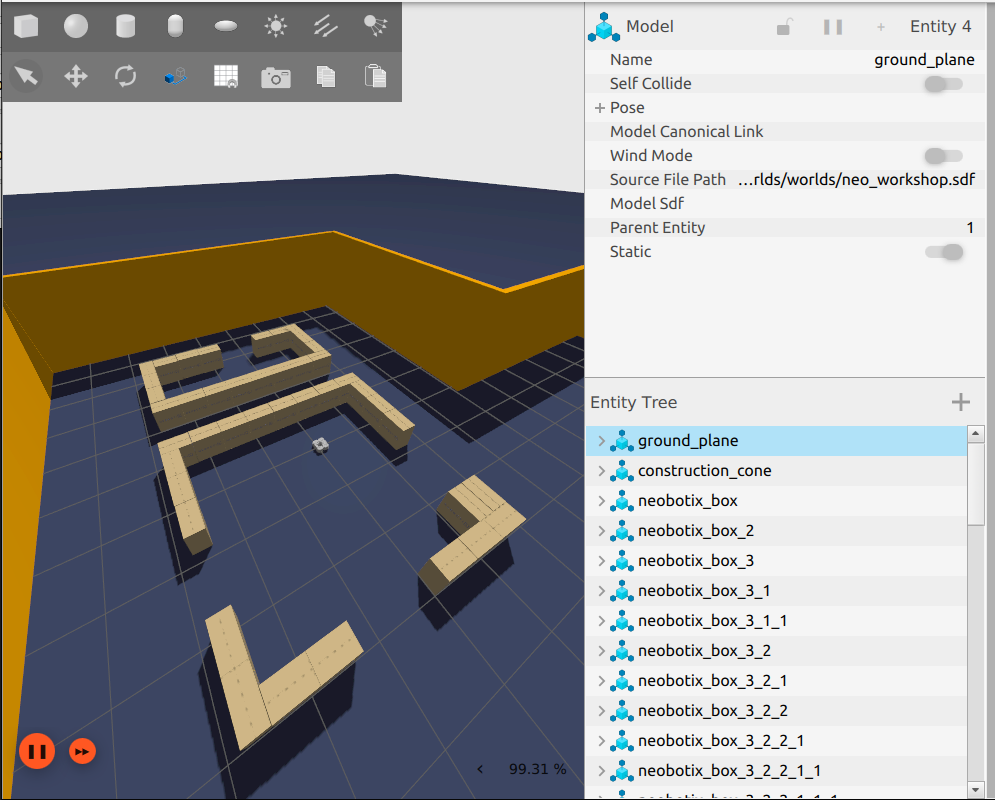
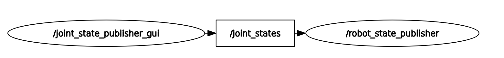

# AMR-simulation-and-navigation

Simulation of an AMR in different gz worlds using ros2 and nav2.
{width=200 height=200}

## Project overview

This ros2 pkg simulates a Turtlebot3 in a small warehouse in Gazebo fortress using ROS2 Humble distro. Nav2 was also used for the navigation stack of the AMR.

## System diagram



## Prerequisites and dependencies

This project requires the following softwares:
 - Ubuntu 22.04
 - ROS 2 [Humble](https://docs.ros.org/en/humble/Installation/Ubuntu-Install-Debs.html)
 - Gazebo [Fortress](https://gazebosim.org/docs/latest/ros_installation/)
 - Neobotix [repo](https://github.com/neobotix/neo_gz_worlds.git)
 - Turtlebot3 [repo](https://github.com/ROBOTIS-GIT/turtlebot3_simulations.git)

## Installation instructions

1. Clone the repo
```bash
git clone https://github.com/R3nat012/AMR-simulation-and-navigation.git
```

2. Install dependencies
```bash
cd your_ws
rosdep install --from-paths src --ignore-src -r -y
```

3. Build the workspace
```bash
cd your_ws
colcon build
source install/setup.bash
```

## Usage
Bringup the robot and the first world in gz

```bash
ros2 launch AMR-simulation-and-navigation amr_tes1.launch.py
```

## Project structure

```text
.
└── AMR-simulation-and-navigation
    ├── CMakeLists.txt
    ├── images
    │   ├── architecture.png
    │   └── Exmpl1.png
    ├── include
    │   └── amr_sim
    ├── launch
    │   ├── amr_tes1.launch.py
    │   └── bringup.launch.py
    ├── package.xml
    ├── README.md
    └── src
```

## Features and roadmap

Future updates and debugging:
 - Gazebo fortress world launch - [x]
 - Spawn robot [x]
 - Teleop [x]
 - Nav2 (In process)
 - SLAM (In process)

## References

Credits to DYNAMIXEL and Neobotix 